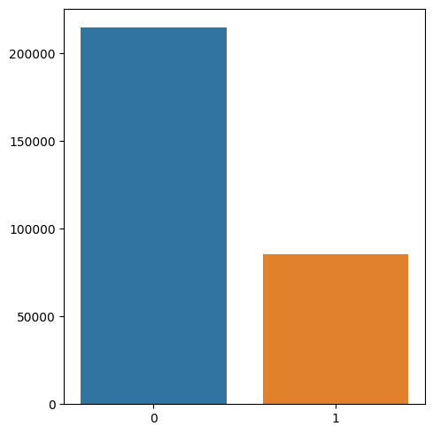
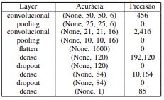
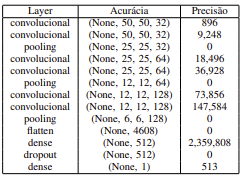
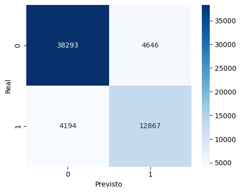
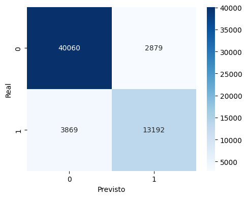
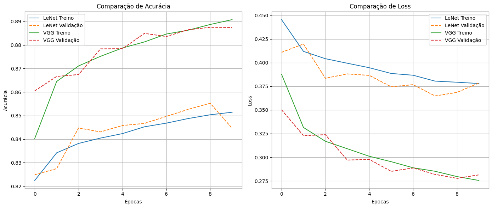

# 🩺 Breast Cancer Detection in Histopathological Images

Este projeto investiga a aplicação de **Deep Learning** para detectar **Carcinoma Ductal Invasivo (IDC)** em imagens histopatológicas de tecido mamário. Foram testadas duas arquiteturas de redes neurais convolucionais — **LeNet** e **VGG-Custom** — utilizando o dataset **Breast Histopathology Images**.

> O estudo foi desenvolvido como parte de um trabalho acadêmico e poderá ser expandido como tema de TCC.

---

## 📂 Dataset

- **Fonte**: [Breast Histopathology Images - Kaggle](https://www.kaggle.com/datasets/paultimothymooney/breast-histopathology-images)
- **Tamanho original**: 555.048 imagens RGB de **50×50 px**
- **Conjunto utilizado**: 300.000 imagens  
  - Negativas (sem IDC): 214.696  
  - Positivas (com IDC): 85.304  

📊 **Distribuição das classes:**

---

## 🛠 Metodologia

### 1️⃣ Pré-processamento
- Imagens mantidas no tamanho original (50×50 px, RGB)
- Divisão treino/teste: **80% / 20%** com estratificação por classe
- Nenhuma técnica de **data augmentation** ou **balanceamento artificial** foi aplicada

### 2️⃣ Arquiteturas Testadas

#### 🧠 LeNet
- 8 camadas ocultas
- ~204 mil parâmetros treináveis
- Estrutura simples para avaliar baseline

#### 🧠 VGG-Custom
- 10 camadas ocultas
- ~2,63 milhões de parâmetros treináveis
- Convoluções duplas em blocos, inspiradas na VGG original

##📐 Arquiteturas detalhadas:

## 📊 Resultados

| Modelo      | Acurácia | Precisão (Positiva) | Recall (Positiva) | F1-score (Positiva) |
|-------------|----------|--------------------|-------------------|---------------------|
| **LeNet**   | 85,27%   | 0,7347             | 0,7542            | 0,7443              |
| **VGG-Custom** | **88,75%** | **0,8209**         | **0,7732**        | **0,7963**          |

##🔍 Matrizes de confusão:

##📈 Curvas de treino:

---

## 📌 Conclusões
- **VGG-Custom** apresentou desempenho superior em todas as métricas.
- Redução significativa de **falsos negativos** — importante em aplicações médicas.
- Potencial de melhoria com:
  - **Data augmentation**
  - **Balanceamento de classes**
  - **Arquiteturas mais complexas**
